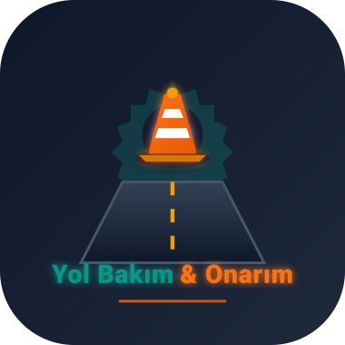

<div align="center">

  <!-- 🟢 CEPTE RADAR LOGO -->
  

  <h1>🛡️ Cepte Radar — Canlı Trafik, Radar & Yol Durumu Takip Sistemi</h1>

  <p>
    <b>Karayolları Genel Müdürlüğü (KGM) verilerine ve canlı coğrafi analizlere dayalı radar, hız koridoru, trafik denetim alanları ve yol çalışma takip platformu.</b>
  </p>

</div>

---

## 🌟 Proje Modülleri ve Logoları

Uygulama iki temel harita modülünden oluşmaktadır:

### 1. Cepte Radar Ana Modülü (`index.html`)
Canlı radar noktalarını, hız koridorlarını, trafik denetim alanlarını, hava durumunu, il bazlı denetim dağılımını ve sürücü risk skorunu sunan ana modül.

### 2. KGM Yol Bakım Onarım & Kapalı Yollar Modülü (`main.html`)
Karayolları Genel Müdürlüğü (KGM) canlı verileriyle Türkiye genelindeki aktif yol çalışmalarını, şantiyeleri ve kapalı geçitleri gösteren harita modülü.

<div align="center">
  <br>

  <!-- 🚧 KGM YOL BAKIM & ONARIM LOGO -->
  
  <br>
  <sub><i>KGM Canlı Yol Çalışmaları & Kapalı Yollar Modül Logosu</i></sub>
</div>

---

## 🚀 Öne Çıkan Özellikler

- 📸 **Canlı Radar & Kontrol Noktaları:** Güzergah üzerindeki sabit/mobil radarları ve polis/jandarma denetim noktalarını anlık harita üzerinde görselleştirme.
- ⚡ **Hız Koridorları & Limit Tabelaları:** Ortalama hız ihlal bölgelerini kesikli kırmızı hatlarla ve hız limiti tabelalarıyla gösterme.
- 🚧 **KGM Canlı Yol Çalışmaları & Kapalı Yollar:** Karayolları Genel Müdürlüğü (KGM) ArcGIS servis altyapısıyla Türkiye genelindeki aktif yol bakımlarını, onarım sahalarını ve kapalı yolları canlı sorgulama.
- 📡 **Kesintisiz Akıllı Konum Takibi:** GPS sinyali zayıfladığında Wi-Fi, hücresel veri ve IP yer tespiti altyapısıyla kilitlenmeden arka planda konum takibi.
- 🔊 **Sesli Yaklaşım İkazı (Web Speech API):** Güzergahtaki radar, kontrol noktaları, hız koridorları veya yol çalışmalarına **1.5 km** mesafe kaldığında Türkçe sesli ikaz verme.
- 🌤️ **Canlı Meteoroloji & Görüş Mesafesi:** Rota başlangıç, varış ve orta noktalarında anlık sıcaklık, rüzgar ve görüş mesafesi (km) analizi.
- ⚠️ **Güzergah Risk Skoru:** Seçilen rotadaki denetim ve radar yoğunluğuna göre %0 ile %100 arasında otomatik risk analizi.
- 🔍 **Tam SEO ve Sosyal Medya Entegrasyonu:** Open Graph, Twitter Cards, Schema.org (JSON-LD) ve bot dostu semantik metin yapıları.
- 🖥️ **Tam Ekran & Çift Tema Desteği:** Koyu tema destekli arayüz, gerçek karayolu katmanı ve tek tıkla tam ekran harita deneyimi (`ESC` tuşu entegrasyonlu).

---

## 🛠️ Kullanılan Teknolojiler

- **Frontend:** HTML5, CSS3, JavaScript (ES6+), Tailwind CSS
- **Harita & Coğrafi Veri:** Leaflet.js, ArcGIS API for JavaScript, Esri Leaflet, OpenStreetMap Tile Servisleri
- **Haritalama & Rota Servisi:** OSRM (Open Source Routing Machine) API
- **Hava Durumu API:** Open-Meteo API
- **Veri Kaynağı:** Karayolları Genel Müdürlüğü (KGM) MapServer Servisleri
- **Bildirim & Arayüz Elemanları:** SweetAlert2, Web Speech API (Sesli Okuma)

---

## 📁 Proje Dosya Yapısı

```struct
cepteradar/
├── assets/
│   ├── logo.svg            # Cepte Radar Ana Logosu
│   └── logo-work.svg       # KGM Yol Bakım & Onarım Logosu
├── iller/                  # Ham İl/İlçe Rota JSON Verileri
├── iller_kucuk/            # Sıkıştırılmış & Optimize Edilmiş JSON Verileri
├── index.html              # Cepte Radar Ana Sorgulama & Rota Sayfası
├── main.html               # KGM Canlı Yol Bakım Onarım & Kapalı Yollar Haritası
├── manifest.json           # PWA (Progressive Web App) Desteği
├── sw.js                   # Service Worker Servisi
├── server.js               # Sunucu Başlatma Scripti
└── README.md               # Proje Dokümantasyonu
