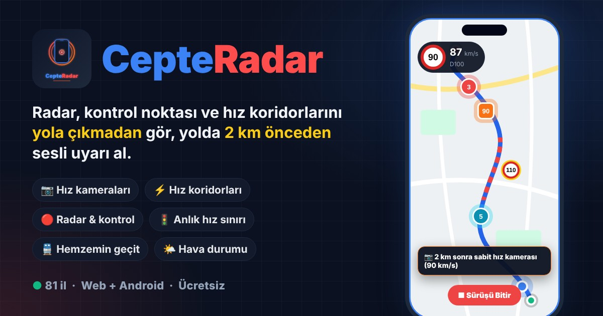
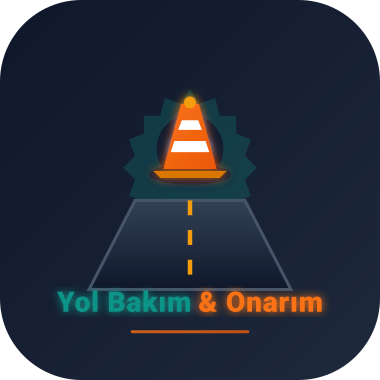

<div align="center">

  

  <h1>Cepte Radar</h1>

  <p><b>İller arası yolculukta radar, kontrol noktası, hız koridoru ve yol tehlikelerini önceden gösteren,<br>
  yolda sesli uyarı veren ücretsiz web sitesi ve Android uygulaması.</b></p>

  

</div>

---

## 🎯 Programın Amacı

Türkiye'de iki il arasında yola çıkacak sürücünün, güzergahında neyle karşılaşacağını **yola çıkmadan
önce görmesini** ve **yolda zamanında uyarılmasını** sağlamak:

- Güzergahta kaç **radar denetimi**, **trafik kontrol noktası** ve **hız koridoru** olduğu (kamuya açık denetim verileri),
- **Hız kameralarının** gerçek konumları (OpenStreetMap),
- **Hemzemin geçit, okul geçidi, tehlikeli viraj, heyelan** gibi riskli noktalar,
- Bulunulan yolun **hız sınırı** ve aşıldığında uyarı,
- KGM'nin bildirdiği **yol çalışmaları ve kapalı yollar**,
- Kalkış ve varış ilinde **anlık hava durumu**.

Amaç cezadan kaçmak değil, sürücünün dikkatli olması gereken yerleri bilmesi ve güvenli sürmesidir.

---

## 📱 Kullanım

### 1. Rota oluşturma
1. **Nereden** ve **Nereye** illerini seçin (⇅ düğmesi yönü değiştirir, **Konumum** bulunduğunuz ili seçer).
2. **ROTA OLUŞTUR**'a basın.
3. Ekranda şunlar görünür:
   - **Bilgi kutusu:** Verinin nereden geldiği (rota kaydı, ters yön kaydı ya da tahmin).
   - **Risk skoru:** Güzergahtaki denetim yoğunluğuna göre %0–%99.
   - **Sayaçlar:** Radar, Kontrol Noktası, Hız Koridoru, Kamera.
   - **Harita:** Rota ve tüm işaretler (yanıp sönenler rotanızın üzerindedir).
   - **Detay:** Hava durumu, *Güzergah Uyarıları* listesi (km sırasıyla; dokununca haritada gösterir),
     hız koridorları ve geçilen illerin denetim dağılımı.

Son aranan rotalar formun altında kısayol olarak durur.

### 2. Sürüş modu
Haritadaki **▶ Sürüş Modu** düğmesine basın ve konum iznini verin. Ekran açık kalır ve:

| Uyarı | Ne zaman |
|---|---|
| Hız kamerası, ortalama hız koridoru başlangıcı | **1 km, 500 m ve 200 m** kala (rota dışında da, gidiş yönünüzdeki kameralar için) |
| Hemzemin geçit, okul geçidi, tehlike noktası | 500 m ve 200 m kala |
| Radar / kontrol noktası bölgesi | 2 km kala (il bazında, yaklaşık konum) |
| Hız sınırı aşımı | Sınır %10'dan fazla aşılınca (en fazla 30 sn'de bir) |
| Yol çalışması / kapalı yol | 2 km kala (sadece KGM katmanı açıksa) |

Sesli uyarılarla birlikte ekranın kenarları uyarının renginde kısa süre parlar.
Uyarılar sadece gidiş yönünüzde önde kalan noktalar için verilir.

- **Hız kadranı:** Sol altta anlık hızınız; sınırın altında yeşil, %10'a kadar üstünde sarı, daha fazlasında kırmızı.
  Sol üstteki tabela bulunduğunuz yolun hız sınırıdır (bilgi yoksa "Genel kural").
- **Ortalama hız koridoru sayacı:** Koridora girince geçen süre, kalan mesafe, ortalamanız, sınırı aşmadan
  çıkışa en erken ne zaman varabileceğiniz ve kalan kısımda önerilen en yüksek ortalama gösterilir. Çıkışta ortalamanız söylenir.
- **HUD modu:** Kadrana dokunun. Siyah ekranda büyük hız, sınır, sıradaki uyarı ve koridor bilgisi çıkar.
  Gece telefonu torpidoya koyup ön cama yansıtmak için **Ayna** düğmesiyle görüntüyü dikey veya yatay çevirin.

### 3. Harita katmanları
Sağ üstteki katman düğmesinden:
- **Gerçek Karayolu Haritası / Koyu Tema**
- **KGM Yol Çalışmaları & Kapalı Yollar** (varsayılan kapalı; seçince açılır, yol çalışmasına tıklayınca ayrıntı gösterir)
- **Tüm Hız Kameraları (Türkiye)** (varsayılan açık)

⛶ düğmesi haritayı tam ekran yapar (`ESC` ile çıkılır). Sağ alttaki **Lejant ▾** işaretlerin anlamını gösterir.

### 4. Haritadaki işaretler

| İşaret | Anlamı |
|---|---|
| Mavi çizgi | Rotanız |
| Kırmızı kesik çizgi + sarı halkalı tabela | Hız koridoru (ortalama hız denetimi); tabelada koridorun hız sınırı |
| Kırmızı yuvarlak, içinde rakam | Radar denetimi; rakam o ildeki radarlı denetim sayısı (il bazında, yaklaşık konum) |
| Turkuaz yuvarlak, içinde rakam | Kontrol noktası; rakam o ildeki radarsız kontrol sayısı (il bazında) |
| Turuncu kare | Sabit hız kamerası; rakam hız sınırı (📷: bilinmiyor) |
| Sarı kare / Mor kare | Ortalama hız kamerası / Mobil radar noktası |
| Küçük turuncu nokta | Türkiye genelindeki kameralar |
| Kırmızı çerçeveli tabela | Hız sınırı tabelası |
| 🚆 / 🏫 / ⚠️ | Hemzemin geçit / Okul geçidi / Tehlike (heyelan, viraj, hayvan geçidi…) |
| Yeşil / Kırmızı nokta | Kalkış / Varış |

### 5. Mobil uygulama arayüzü
Android uygulaması (ve `app.html`) telefona özel bir arayüzle açılır: **Hoş geldiniz** ekranı, rota formu ve
kutucuklu **ana sayfa**, alt kartlı tam ekran **harita** ve **Uyarılar** ekranı. Rota verileri uygulamanın içinde de
bulunur, ama internet varken GitHub'daki güncel `iller_kucuk/` dosyalarından alınır. Yeni rotalar eklendiğinde
uygulamayı güncellemek gerekmez (adres `app.html` içindeki `CEPTE_VERI_URL`).

### 6. Telefona kurulum
- **Android uygulaması (APK):** GitHub → *Actions* → son başarılı "Android APK" çalışması → *Artifacts* → `cepteradar-apk`.
  İndirip telefonda açın (bilinmeyen kaynaklardan yüklemeye izin vermeniz gerekebilir).
- **Ana ekrana ekleme (iPhone ve Android):** Siteyi tarayıcıda açıp *Ana ekrana ekle* deyin; uygulama gibi tam ekran açılır.

---

## 🗂️ Veriler ve Doğruluk

| Bilgi | Kaynak | Not |
|---|---|---|
| Radar, kontrol noktası, hız koridoru sayıları; geçilen iller | Kamuya açık denetim verilerinden derlenmiş il çifti kayıtları | `iller_kucuk/<il>.json`. Veri il bazındadır, radarların tam yerini vermez; sayılar o anki uygulamalardır ve değişir. |
| Hız koridoru konumları | Rota kayıtlarındaki koridor çizgileri | `iller_kucuk/koridorlar.json` |
| Hız kameraları | OpenStreetMap (gönüllü verisi) | `iller_kucuk/osm_radarlar.json`; eksik veya eski olabilir |
| Hemzemin/okul geçidi, tehlike noktaları, hız sınırları | OpenStreetMap (Overpass servisi) | Rota oluşturulunca ve sürüşte anlık alınır |
| Yol çalışmaları | Karayolları Genel Müdürlüğü (KGM) harita servisi | Canlı |
| Rota | Kayıttaki rota çizgisi, yoksa OSRM | |
| Hava durumu | Open-Meteo | Canlı |

**Rota için kayıt yoksa:**
1. Ters yönün kaydı varsa o kullanılır ("ters yön" notuyla).
2. O da yoksa radar ve kontrol sayıları, rotanın geçtiği illerin **başka rotalardaki denetim verilerinden tahmin edilir**
   (`iller_kucuk/il_ozet.json`). Risk göstergesinde "TAHMİNİ" yazar; bilgi kutusu hangi illerin kullanıldığını söyler.

Program hiçbir zaman uydurma radar konumu ya da sayısı göstermez. Veri yoksa "veri yok" der.

Varış listesinde **●** işaretli iller, seçilen kalkış ilinden doğrudan kaydı olan illerdir.

---

## 🔄 Verileri Güncelleme

Kurulum (bir kez): [Node.js](https://nodejs.org) ve Google Chrome kurulu olmalı; proje klasöründe `npm install`.

### Denetim verisi (81 il)
```bash
npm run veri:cek                                    # eksik tüm rotalar (önce büyük şehirler)
npm run veri:cek -- --kalkis izmir                  # sadece bir kalkış ili
npm run veri:cek -- --engel-bekle 15                # engelde 15 dk'da bir yeniden dene
```
Program kaynak sayfayı gerçek bir tarayıcıda açıp her il çifti için "ROTA OLUŞTUR"a basar ve cevabı kaydeder.
Site yaklaşık 12 sorguda bir kısa süreli engel koyar; program bunu tanır, bekler ve kendiliğinden devam eder.
Her il çiftinin tek yönü indirilir (uygulama ters yönü kullanır; iki yön için `--iki-yon`).
Ctrl+C ile durdurup tekrar başlatınca kaldığı yerden devam eder. Bilgisayarı uyku moduna almayın.

### Hız kameraları (OpenStreetMap)
```bash
npm run veri:osm                                    # birkaç saniyede tüm Türkiye
node scripts/osm-cek.mjs export.geojson             # overpass-turbo.eu'dan indirilmiş dosyayı işler
```

### Elinizdeki il dosyalarını ekleme
```bash
node scripts/veri-birlestir.mjs "C:\klasor\iller"   # birleştirir, mevcut kayıtları silmez
```
Kaynak sitenin ham cevabı veya uygulama kaydı (`kalkis_il`, `varis_il`, `radar_sayisi`…) kabul edilir.
Birleştirme sonunda `index.json`, `koridorlar.json` ve `il_ozet.json` yeniden üretilir.

**Büyük dosyalar** (GitHub web yüklemesi 25 MB sınırlıdır) için Python araçları:
```bash
python scripts/iller_incele.py "C:\klasor\iller\adana.json"     # içeriği ve neyin yer kapladığını gösterir
python scripts/iller_kucult.py "C:\klasor\iller" "C:\klasor\iller_kucuk_yeni"   # sayıları koruyup küçültür
```

Değişiklikleri GitHub'a gönderdiğinizde site ve APK yeni verilerle güncellenir.

---

## 💻 Geliştirici Bilgileri

Uygulama tamamen tarayıcıda çalışır; ayrı bir API sunucusu gerekmez.

```bash
npm install
npm start                 # http://localhost:8000
npm run android:apk       # yerelde APK (Android SDK + JDK 21 gerekir)
```

- **Teknolojiler:** HTML, CSS, JavaScript; Leaflet + Esri Leaflet (yerel kopya), Web Speech API (sesli uyarı),
  Geolocation + Wake Lock (sürüş modu), Service Worker (PWA), Capacitor (Android).
- **Otomatik derleme:** Her gönderimde GitHub Actions APK üretir (`.github/workflows/android-apk.yml`);
  `main` dalı GitHub Pages'e yayınlanır (`.github/workflows/pages.yml`, depo ayarlarından Pages açılmalı).

```text
cepteradar/
├── index.html              # Ana uygulama (rota, harita, detay)
├── main.html               # KGM yol çalışmaları & kapalı yollar haritası
├── css/app.css             # Mobil öncelikli arayüz
├── js/
│   ├── app.js              # Arayüz, harita, rota, uyarılar, sürüş modu
│   ├── veri.js             # Veri katmanı (il dosyaları, OSRM, hava durumu, güzergah analizi, OSM)
│   ├── yol.js              # Sürüşte anlık hız sınırı, hız aşımı, hemzemin/okul geçidi
│   ├── iller.js            # 81 il (plaka, ad, koordinat)
│   └── koruma.js
├── iller_kucuk/            # <il>.json rota kayıtları + index, koridorlar, il_ozet, osm_radarlar
├── scripts/                # veri:cek, veri:osm, birleştirme, Python araçları, APK hazırlık
├── vendor/                 # Leaflet & Esri Leaflet
├── assets/                 # Logolar ve uygulama simgeleri
├── manifest.json, sw.js    # PWA
├── capacitor.config.json   # Android paket ayarları
└── server.js               # Yerel statik sunucu (npm start)
```

---

## ⚖️ Yasal Uyarı

Cepte Radar bilgilendirme amaçlıdır. Gösterilen sayılar ve konumlar kamuya açık kaynaklardan derlenir;
eksik, gecikmeli veya hatalı olabilir. Trafik kurallarına ve yol üzerindeki işaretlere uymak her zaman sürücünün
sorumluluğundadır. Sürüş sırasında telefonu elde kullanmayın; sesli uyarılar dikkat dağıtmamak içindir.
Ayrıntılı kullanım şartları uygulamadaki **Yasal** bölümündedir.

Harita ve kamera verileri: © OpenStreetMap katkıda bulunanlar (ODbL) · Yol çalışmaları: KGM · Hava durumu: Open-Meteo.

<div align="center">
  <br>
  
</div>
